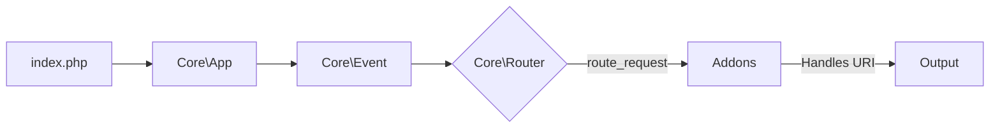

# Zed CMS
## The Antigravity Micro-Kernel CMS

 


**Zed CMS is the answer to 20 years of CMS bloat.** 

We stripped away the ORMs, the backward compatibility wrappers, and the spaghetti code to build a **Micro-Kernel** system that runs on pure PHP 8.2+ and Event Listeners. It's built for developers who want the speed of a framework with the convenience of a CMS.

---

## ⚡ Why Zed?

Stop fighting with legacy codebases.

| Feature | Zed CMS 🚀 | Legacy Systems (WP) 🐢 |
| :--- | :--- | :--- |
| **Architecture** | **Event-Driven Micro-Kernel** | Monolithic Procedure Wrapper |
| **Routing** | **Decentralized (Event Listeners)** | Static Tables / Regex Hell |
| **Database** | **Direct PDO (JSON-Optimized)** | heavy ORM / EAV Nightmares |
| **Media** | **Native WebP Pipeline + Batch Ops** | Requires 3rd Party Plugins |
| **Editor** | **React Block Editor (JSON)** | HTML WYSIWYG (Tag Soup) |
| **Dark Mode** | **Built-in (localStorage)** | Requires Plugin |
| **Load Time** | **< 20ms Core Boot** | 200ms+ Core Boot |

---

## 🏗 Technical Architecture

Zed is built on a **Micro-Kernel** that is less than **500 lines of code**. It does not strictly define "Posts" or "Pages" in the core; it simply dispatches events.

### The Request Lifecycle



1.  **Boot:** `Core\App` initializes the immutable Singleton Database connection.
2.  **Dispatch:** `Core\Router` analyzes the URI.
3.  **Event:** The system fires `route_request`.
4.  **Claim:** An Addon (like `admin_addon.php`) listens, matches the URI, executes logic, and calls `Router::setHandled()`.

This means you can replace the **entire Admin Panel** just by disabling one addon file.

---

## 🛠 Features for Developers

### 🧱 BlockNote Block Editor
No more `strip_tags()`. Content is saved as structured **JSON blocks** using BlockNote (React-based, Notion-style).
*   **Clean Data:** `{ type: "paragraph", content: [{ type: "text", text: "Hello" }] }`
*   **Portability:** Render natively in React, Vue, or iOS apps.
*   **Theming:** Dynamic light/dark mode, CSS variable support.


### 🖼 Smart Media Pipeline
Drop a 5MB JPEG? Zed automatically:
1.  **Resizes** to 1920px max-width.
2.  **Converts** to optimized **WebP** (80% q).
3.  **Generates** a 300px Thumbnail.
4.  **Backs up** the original file.
*All without a single plugin.*

### 🔐 Enterprise RBAC
Role-Based Access Control is baked into the core.
*   **Capabilities:** `edit_content`, `manage_users`, `upload_media`.
*   **Ownership:** Authors can only edit *their* own posts.
*   **Security:** Self-lock protection prevents admins from demoting themselves.

### 📚 Integrated Wiki
Documentation shouldn't be a browser tab away. Zed ships with a **Native Markdown Wiki** inside the Admin Panel that reads directly from your `content/docs/` folder.

### 🌙 Professional Dark Mode (v2.5.0)
*   **Toggle Button:** Sun/moon icon in admin header.
*   **Persistence:** Saved to localStorage, persists across sessions.
*   **FOUC Prevention:** Theme loads before content renders.

### 📦 Batch Operations (v2.5.0)
*   **Content:** Select all checkbox, individual row checkboxes, bulk delete.
*   **Media:** Card checkboxes, selection counter, multi-file delete.

---

## 🚀 Quick Start

### Prerequisites
*   PHP 8.2+ (Extensions: `pdo`, `gd`, `json`)
*   MySQL 5.7+

### Installation

1.  **Clone**
    ```bash
    git clone https://github.com/antigravity-cms/zero.git .
    ```

2.  **Config**
    Rename `config.sample.php` to `config.php` and update DB credentials.

3.  **Install**
    Visit `http://your-site.com/install.php`.
    *   *Checks permissions.*
    *   *Creates tables.*
    *   *Seeds admin user.*

4.  **Secure**
    ```bash
    rm install.php migrate_options.php
    ```

---

## 🤝 Contributing

Zed is young, fast, and opinionated. We are looking for **Architects**, not just coders.

### We need help with:
*   **Frontend Themes:** Building more beautiful themes with the Theme API.
*   **Cache Driver:** Redis integration for the `Core\Cache` layer.
*   **Real-Time Charts:** Connecting dashboard charts to actual analytics data.

**Fork it. Break it. Fix it.**

---

## 📜 License
Zed CMS is open-sourced software licensed under the **[MIT license](LICENSE)**.

---

*Built with NO gravity.* 
